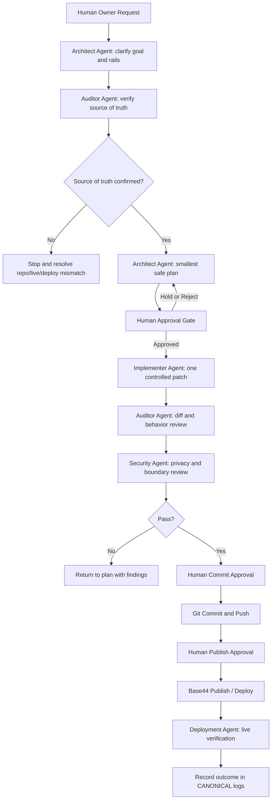

# CANONICAL Agent Council Flow

**Version:** 0.1  
**System:** Canonical Program OS / PRISM / AYA-CTS  
**Purpose:** Define how multiple AI agents, tools, and the human owner coordinate without turning the project into a very expensive junk drawer with Wi-Fi.

---

## 1. Core Principle

Different tools are good at different jobs.

A hammer is a bad screwdriver.  
A screwdriver is a bad hammer.  
An autonomous agent is a bad unchecked authority.

The Agent Council exists because no single model or tool should be trusted to act as architect, implementer, auditor, security reviewer, deployment manager, and publisher at the same time.

---

## 2. Core Rule

> **No agent may change system state until the source of truth has been verified.**

System state includes:

- Git commits
- GitHub pushes
- Base44 publishes
- DNS changes
- Dropbox file moves
- PRISM private data migration
- Google Classroom exports
- ClickUp exports
- live connector writes
- production environment changes

---

## 3. Agent Roles

### 3.1 Human Owner

**Final authority.**

Responsibilities:

- Approves movement between phases.
- Defines priority.
- Confirms whether work matches real-world intent.
- Protects program boundaries.
- Decides when to publish, commit, push, seed, migrate, or deploy.

No agent outranks the human owner.  
The owner may delegate tasks, not authority.

---

### 3.2 Architect Agent

**System designer and boundary keeper.**

Best used for:

- program architecture
- schema design
- workflow design
- prompt design
- policy rules
- AYA / CTS / PRISM / CANONICAL separation
- long-term product direction
- translating messy intent into structured tasks

Must not:

- directly edit production code without approval
- publish
- commit
- move files
- run live connector writes

Primary output:

- architecture notes
- implementation briefs
- patch plans
- agent prompts
- decision records

---

### 3.3 Implementer Agent

**Repo surgeon.**

Best used for:

- tracing files
- making small code changes
- fixing bugs
- wiring existing functions
- adding narrow features
- updating tests
- running local build checks

Must not:

- redesign broad systems during a bug fix
- implement multiple unrelated findings at once
- publish
- commit without approval
- change DNS
- run live connector writes
- expose private data

Primary output:

- changed files
- diff summary
- test instructions
- known risks

---

### 3.4 Auditor Agent

**Reality checker.**

Best used for:

- comparing local vs GitHub vs live
- checking routes
- checking source-of-truth drift
- reading diffs
- confirming whether code is imported, routed, or called
- detecting unused/decorative changes
- validating whether a patch actually affects the app

Must not:

- make fixes during audit
- refactor
- publish
- commit
- mutate files

Primary output:

- audit report
- source-of-truth matrix
- route map
- changed-file review
- implementation readiness rating

---

### 3.5 Security / Privacy Agent

**Boundary and exposure reviewer.**

Best used for:

- public/demo/owner separation
- PRISM private data exposure checks
- frontend bundle leak checks
- owner/admin auth review
- connector credential review
- role and permission logic
- privacy QA

Must not:

- rely on UI hiding as security
- accept query string mode as authorization
- approve private content inside public bundles
- expose secrets or tokens in logs, diagnostics, or frontend state

Primary output:

- privacy findings
- bundle scan requirements
- owner/admin access findings
- accepted risk notes

---

### 3.6 Deployment Agent

**Pipeline and environment checker.**

Best used for:

- GitHub push status
- Base44 sync/publish checks
- custom domain checks
- CDN/cache mismatch checks
- build artifact verification
- live vs local comparison
- DNS and SSL checks

Must not:

- change DNS without explicit approval
- publish without explicit approval
- assume live equals local
- assume GitHub equals Base44
- assume Dropbox sync equals Git push

Primary output:

- deployment status
- publish checklist
- live verification notes
- rollback notes

---

## 4. Work Phases

### Phase 0 — Intake

Goal: capture the request without touching the system.

Required output:

- plain-English goal
- affected program or rail
- affected repo/folder
- expected user outcome
- known constraints

Example:

```text
Goal: Make owner/admin mode show full PRISM data to the verified owner.
Rail: PRISM_PRIVATE
Repo: BASE44_CANONICAL_GITHUB_SYNC
Constraint: public/demo users must not receive PRISM private data.
```

---

### Phase 1 — Source-of-Truth Verification

Goal: identify which reality is real.

Check:

- local repo path
- current branch
- git remote
- git status
- GitHub main state
- Base44 live app
- custom domain
- export/archive folders
- Dropbox sync location
- parallel repos or worktrees

Required output:

```text
Source of truth confirmed:
Local repo:
GitHub remote:
Live app:
Custom domain:
Archive/export folders:
Parallel repos:
Risk:
```

No implementation may begin until this phase is complete.

---

### Phase 2 — Plan

Goal: define the smallest safe change.

Required output:

- exact files to touch
- reason each file must be touched
- expected behavior after change
- testing plan
- security/privacy risks
- rollback path

Forbidden:

- broad refactors
- unrelated cleanup
- styling changes unless required
- multi-feature patches

---

### Phase 3 — Approval Gate

Goal: owner confirms the plan.

Allowed owner responses:

```text
Approved: implement only this patch.
Rejected: revise plan.
Hold: do not continue.
```

No agent may interpret silence as approval.  
No agent may treat “looks good” as approval to publish.

---

### Phase 4 — Implementation

Goal: make only the approved change.

Rules:

- change the fewest files possible
- do not broaden scope
- do not fix adjacent issues unless approved
- do not touch unrelated rails
- preserve AYA / CTS / PRISM / CANONICAL separation
- do not publish
- do not commit unless explicitly approved

Required output:

- changed files
- diff summary
- behavior changed
- manual test steps
- automated checks run
- known unresolved issues

---

### Phase 5 — Review

Goal: confirm the patch did what it claimed.

Auditor checks:

- changed files match approved plan
- code is routed/imported/called
- owner/demo behavior matches expected result
- privacy boundary still holds
- no unrelated changes occurred
- build/lint/privacy checks pass where relevant

Security checks:

- no private PRISM data in public bundle
- no secrets/tokens in frontend
- no query-string-only owner unlock
- no write controls visible to demo/public users
- no PRISM private language in AYA student-facing outputs

---

### Phase 6 — Commit / Push Gate

Goal: decide whether the local patch should move to GitHub.

Required before commit:

- owner approval
- diff reviewed
- tests passed or known failures documented
- commit message approved

Recommended commit format:

```text
Add owner-private PRISM backend access
Fix owner mode program fetch path
Strip private PRISM data from public bundle
Add canonical inbox manifest schema
```

Do not commit generated junk, secrets, local env files, or one-off exports.

---

### Phase 7 — Publish Gate

Goal: decide whether GitHub changes should move to Base44/live.

Required before publish:

- GitHub push complete
- Base44 sees current repo state
- build passes
- environment variables confirmed
- owner understands live impact
- rollback path exists

Publishing is a separate approval from committing.

---

### Phase 8 — Live Verification

Goal: verify reality, not vibes.

Check:

- live Base44 app
- custom domain
- relevant route
- public/demo behavior
- owner/admin behavior
- non-owner behavior if possible
- browser-rendered page
- raw fetched HTML if SEO/shell issue is relevant

Required output:

```text
Live verified:
Route:
Expected:
Actual:
Pass/Fail:
Notes:
```

---

## 5. CANONICAL Rails

### AYA / CTS Rail

Institutional and classroom-facing material.

Allowed outputs:

- daily runs
- student handouts
- quizzes
- instructor guides
- shop instructions
- evidence sheets
- Google Classroom exports
- public-safe program summaries

Do not include:

- PRISM private framework language
- owner-only notes
- private file paths
- raw logs
- internal AI reasoning traces
- connector credentials

---

### PRISM Rail

Owner-private framework and facilitator logic.

Allowed for verified owner/admin:

- full PRISM program data
- facilitator overlays
- private framework notes
- source indexes
- generation profiles
- private operational metadata
- PRISM-to-AYA separation guidance

Public/demo users may see:

- demo-safe summaries only

Rule:

> **PRISM is owner-private, not owner-hidden.**

---

### CANONICAL Rail

System infrastructure and operating spine.

Includes:

- inbox parsing
- source indexing
- generation pipeline schemas
- agent council protocol
- connector maturity model
- owner/admin policy
- package proof structure
- audit logs
- deployment notes

---

## 6. Capability Labels

Every feature should be labeled truthfully.

Allowed labels:

- `Demo only`
- `Owner available`
- `Dry-run available`
- `Live write enabled`
- `Backend declared`
- `Backend wired`
- `Not implemented`
- `Needs seeding`
- `Needs owner auth`
- `Blocked by config`
- `Blocked by publish`
- `Unknown`

Forbidden labels:

- vague “coming soon” where a real blocker is known
- pretending declared functions are live
- pretending UI previews are working features
- hiding broken behavior behind polished copy

---

## 7. Standard Council Flow



---

## 8. Emergency Stop Conditions

Stop immediately if an agent:

- tries to publish without approval
- tries to commit without approval
- edits outside the approved file list
- exposes PRISM private data publicly
- changes AYA/CTS content while fixing PRISM
- runs live connector writes without approval
- claims success without test evidence
- cannot identify the active repo
- confuses local, GitHub, Base44, and custom domain states
- suggests another broad autonomous fix after a failed broad autonomous fix

Emergency response:

```text
STOP.
Do not make more changes.
Report current git status, changed files, and last action taken.
```

---

## 9. Standard Prompts

### 9.1 Audit Prompt

```text
Run read-only audit mode.
Do not edit files.
Do not commit.
Do not publish.
Verify source of truth first.
Report route map, auth flow, owner/admin gates, backend declared vs wired, and live/local/GitHub drift.
Stop after the report.
```

---

### 9.2 One-Patch Implementation Prompt

```text
Implement only the approved patch.
Change the fewest files possible.
Do not refactor unrelated code.
Do not publish.
Do not commit unless explicitly approved.
After editing, show changed files, diff summary, tests run, and manual test steps.
Stop.
```

---

### 9.3 Deployment Verification Prompt

```text
Verify deployment only.
Compare local, GitHub, Base44, and custom domain behavior.
Do not edit files.
Do not change DNS.
Do not publish.
Report what is live, what is stale, and what action is needed.
```

---

### 9.4 Privacy Review Prompt

```text
Review privacy boundaries only.
Check public/demo vs owner/admin access.
Check frontend bundle for private PRISM data.
Check connector secrets and raw logs.
Check query-string owner mode behavior.
Do not edit files.
Report findings and smallest safe fix.
```

---

## 10. Decision Record Template

```markdown
# Decision Record: [Title]

Date:
Owner:
System:
Rail:

## Context

## Decision

## Why

## Risks

## Alternatives Considered

## Required Follow-Up

## Status
Proposed | Approved | Implemented | Superseded
```

---

## 11. Operating Maxim

> Use each model like the tool it is.

Hammers are bad screwdrivers.  
Screwdrivers are bad hammers.  
Agents are bad governments.

The council exists so each tool does the work it is suited for, while the human owner keeps authority over the system.

---

## 12. Related Documents

- [CANONICAL Program Generation Pipeline v0.1](./CANONICAL_Program_Generation_Pipeline_v0_1.md)
